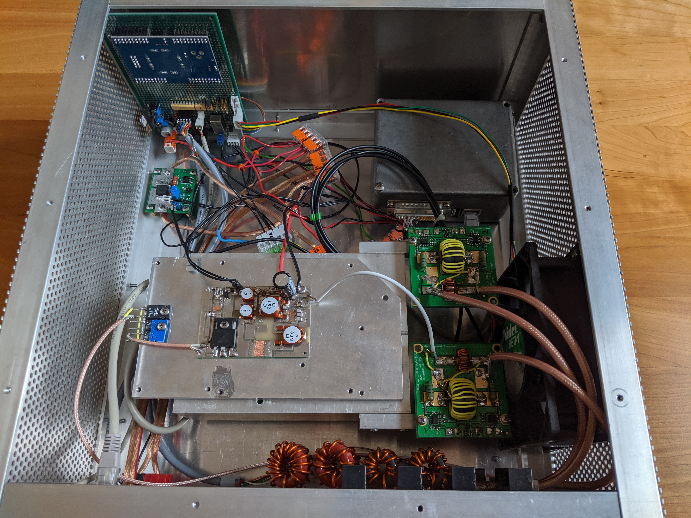

# pa

Power Amplifier with Interface to Hermes Lite 2 (HL2)

#### Frontpanel
- Push-Button for turning on 50V supply
- Switch to select StandBy/Operate
- Green LED for 50V indication
- Dual Color LED for Operate (green) and Tx (red)

#### Connectors
- APP 75A 50V Supply
- APP 15A 12V Supply
- RJ45 LAN Web Server for monitoring
- DB9 Band Selector Input
- 3.5mm (optional)
- Chinch PTT
- PL259 Input (< 5W)
- PL259 Output 
- SMA Pickup for predistortion (optional) 

#### Amplifier Board with 10 dB Attenuator
- input cicuit just attenuater and a 1nF capacitor (seems that nxp has not finished the reference circuit for 13.56MHz)
- attenuator with 3 resistors (100-75-100 Ohm)

#### PCB
- KiCad design (1x MRF300AN / 5x MRF101AN)
- boards from jlcpcb.com
- first test with tiny MRF101AN board - output power abt. 120W

#### Control and Protection
- Control board with CPLD (LC Technology MAX II EPM240)
- PTT, Rx/Tx sequencing, band selection with driver, LEDs, Buttons, FAN PWM
- seperate over current protection board with BTS50085 (BTS660) set to 8A

#### Filter, SWR and Monitoring
- Low-Pass-Filter from W6PQL (only 10, 20, 40 and 80m assembled)
- 160m not assembled / 6m relays used for Rx/Tx
- 2 Coupler from DJ0ABR to protect amplifier from High SWR (filter and antenna)
- orange pi one (small die cast housing) with ADC (Abio Card) for monitoring Current, SWR and temperature

#### Hermes Lite 2 
- standard die cast housing
- thermal contact to PA transistors via copper tape
- band select just used wires from P1-P7 and GND to DB9 (level shift with opto coupler in PA) 

#### Station
- HL2 with amplifier and LDG AT-200Pro II Tuner transmitting at 14.1MHz
- Output Power is at the limit of LDG (240W @ 45V/7A)
- Power Supply is Cisco Catalyst 6000 6500 Sony APS-162(ID) 1300W PSU P/N 34-0918-02 8-681-326-21
- Output voltages (3.3V, 5V, 12V and 42V/27.5A (can be set to 45V with trimmer)) 

